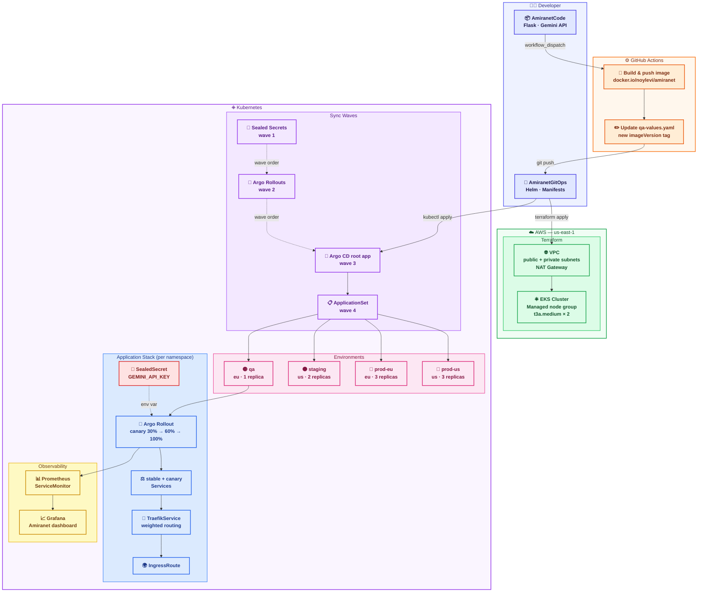

# AmiranetGitOps 🚀

> GitOps repository for the Amiranet AI exam simulation application.  
> For the application source code, see 👉 [AmiranetCode](https://github.com/NoyLevi24/AmiranetCode)

---

## Architecture Overview

This repository is the **single source of truth** for all Kubernetes manifests and configurations. All changes to the cluster are made exclusively through Git — no manual `kubectl apply` commands. Argo CD continuously reconciles the cluster state with what is defined here.
 
---



---

## Repository Structure
### 3-Level App of Apps Pattern

```
.
├── root-app/                        # Level 1 — Root Application
│   └── my-application.yaml          # App of Apps entry point
│
├── my-app-list/                     # Level 2 — child applications
│   ├── sealed-controller.yaml       # Sealed Secrets controller WAVE1
│   ├── rollouts-controller.yaml     # Argo Rollouts controller WAVE2
│   ├── prometheus-stack.yaml        # Prometheus & Grafana WAVE3
|   └── amiranet-appset/             # ApplicationSet — multi-environment WAVE4
│
├── manifests/                       # Level 3 — workload manifests
│   ├── amiranet-appset/
│   │   ├── env-config/              # per-env config.json (region, type, chart)
│   │   │   ├── qa/
│   │   │   ├── staging/
│   │   │   └── prod/{eu,us}/
│   │   ├── my-chart/                # Helm chart
│   │   │   └── templates/
│   │   │       ├── rollout.yaml
│   │   │       ├── service.yaml
│   │   │       ├── traefik-service.yaml
│   │   │       ├── ingress-route.yaml
│   │   │       ├── servicemonitor.yaml
│   │   │       ├── grafana-dashboard.yaml
│   │   │       └── gemini-api-key-encrypted.yaml
│   │   └── my-values/               # Helm value overrides
│   │       ├── common-values.yaml
│   │       ├── app-version/         # qa / staging / prod
│   │       ├── replicas/            # 1 / 2 / 3
│   │       ├── settings/            # resource requests & limits
│   │       ├── env-type/            # non-prod / prod
│   │       ├── regions/             # eu / us
│   │       └── envs/                # per-env labels
│   ├── rollouts-controller/
│   └── sealed-controller/
│
├── terraform/                       # AWS infrastructure
│   ├── providers.tf
│   ├── variables.tf
│   ├── main.tf                      # VPC + EKS modules
│   ├── outputs.tf
│   └── terraform.tfvars
│
└── .github/workflows/
    └── promote.yaml                 # QA → Staging → Prod promotion
```

---

## GitOps Principles

| Principle | Implementation |
|---|---|
| Declarative configuration | All resources defined as YAML / Helm |
| Git as single source of truth | No manual `kubectl apply` — Git only |
| Continuous reconciliation | Argo CD auto-syncs on every commit |
| Secret management | Sealed Secrets — encrypted at rest in Git |

---

## Applications Dependencies with Sync Waves
 
```
Root Application  (root-app/)
        │
        ├── sealed-controller      wave 1
        ├── rollouts-controller    wave 2
        └── amiranet               wave 3
                │
                └── Rollout + Services + Ingress + Secrets
```
 
Sync waves ensure dependencies are deployed in the correct order — the Sealed Secrets controller is ready before secrets are applied, and Argo Rollouts is ready before the Rollout resource is created.
 
---

## Environments

| Environment | Region | Type | Replicas | Prometheus |
|---|---|---|---|---|
| `qa` | eu | non-prod | 1 | ✗ |
| `staging` | us | non-prod | 2 | ✗ |
| `prod-eu` | eu | prod | 3 | ✓ |
| `prod-us` | us | prod | 3 | ✓ |

---

## Deployment Strategy

Traffic is split between **stable** and **canary** services via a Traefik weighted service. Argo Rollouts manages the promotion steps:

```
New version deployed → 30% canary traffic → pause (manual approval)
                     → 60% canary traffic → pause (manual approval)
                     → 100% stable        → pause (final confirmation)
```

---

## Multi-Environment Promotion

Promotion between environments is triggered via **GitHub Actions** (`workflow_dispatch`).

```
QA ──► Staging ──► Production
```

Promotion of a new image version to the qa environment is triggered by the CI pipeline in [AmiranetCode](https://github.com/NoyLevi24/AmiranetCode) — which automatically commits the new image version to the relevant `qa-values.yaml` file, causing Argo CD to detect the change and sync.

**Workflow:** `.github/workflows/promote.yaml`

Supports independent promotion of:
- Container image version (`promote_container`)
- Application settings — resource requests/limits (`promote_settings`)
- Replica count (`promote_replicas`)

---

## Infrastructure (Terraform)

Managed by Terraform using the official AWS community modules.

| Resource | Module | Notes |
|---|---|---|
| VPC | `terraform-aws-modules/vpc/aws` | 2 public + 2 private subnets, 1 NAT GW |
| EKS | `terraform-aws-modules/eks/aws` | Managed node group, cluster-admin for caller |
| Node group | — | `t3a.medium`, auto-scaling 1–4 nodes |
| Add-ons | — | CoreDNS, kube-proxy, VPC CNI, EBS CSI |

### First-time setup

```bash
cd terraform
terraform init
terraform plan
terraform apply
```

After apply, configure `kubectl`:

```bash
aws eks update-kubeconfig --region "us-east-1" --name amiranet-cluster
```

Then bootstrap Argo CD and hand control to GitOps:

```bash
kubectl create namespace argocd
kubectl apply -n argocd \
  -f https://raw.githubusercontent.com/argoproj/argo-cd/stable/manifests/install.yaml

kubectl apply -f root-app/my-application.yaml
```

---

## Secret Management

Secrets are encrypted using the **Sealed Secrets** controller.  
The encrypted `SealedSecret` YAML is safe to commit to Git — only the in-cluster controller can decrypt it.

```bash
kubectl create secret generic gemini-api-key \
  --from-literal=GEMINI_API_KEY=YOUR_KEY \
  --dry-run=client -o yaml | kubeseal -o yaml > encrypted-secret.yaml
```

---

## Observability

The production environments expose a custom **Grafana dashboard** with:

| Metric | Type |
|---|---|
| Exams generated / failed | Counter |
| Gemini API call rate & error rate | Counter |
| Exam generation duration (avg, p95, p99) | Histogram |
| Active exams | Gauge |
| Flask process CPU & memory | Gauge |

Metrics are scraped by Prometheus via a `ServiceMonitor` (enabled only when `prometheusEnabled: true`).

---

## Sync Waves

```
Root Application
    │
    ├── 🔐 sealed-controller      wave 1   (secrets infrastructure first)
    ├── 🔄 rollouts-controller    wave 2   (deployment strategy second)
    └── 📋 amiranet-appset        wave 4   (application — all environments)
```
